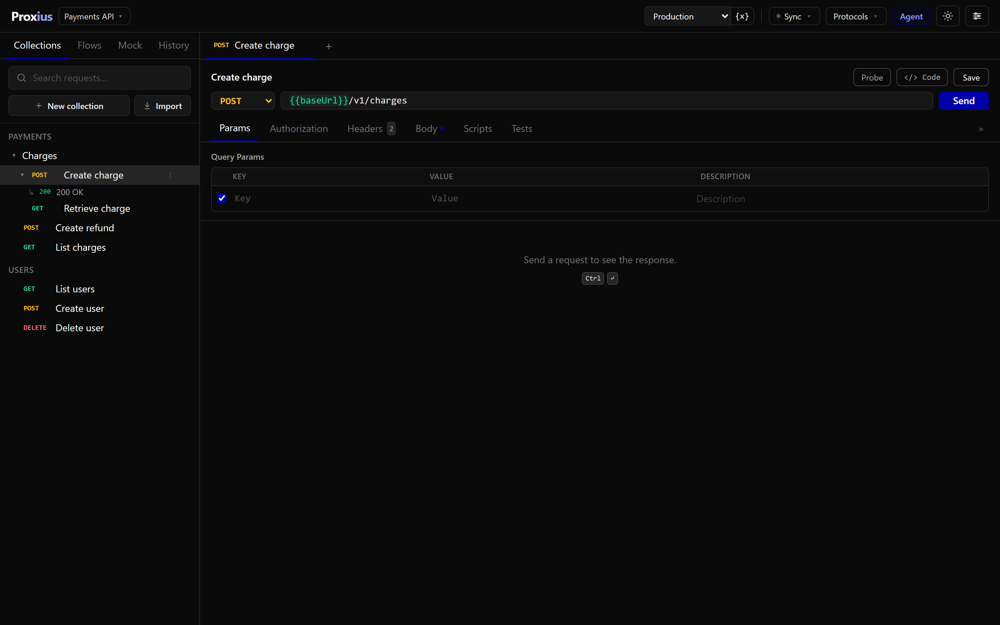
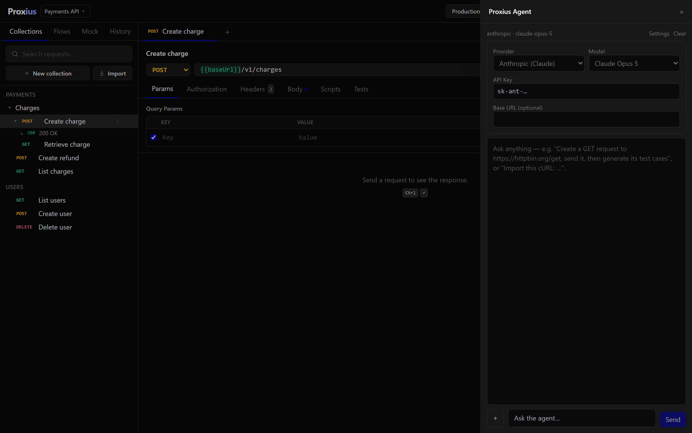
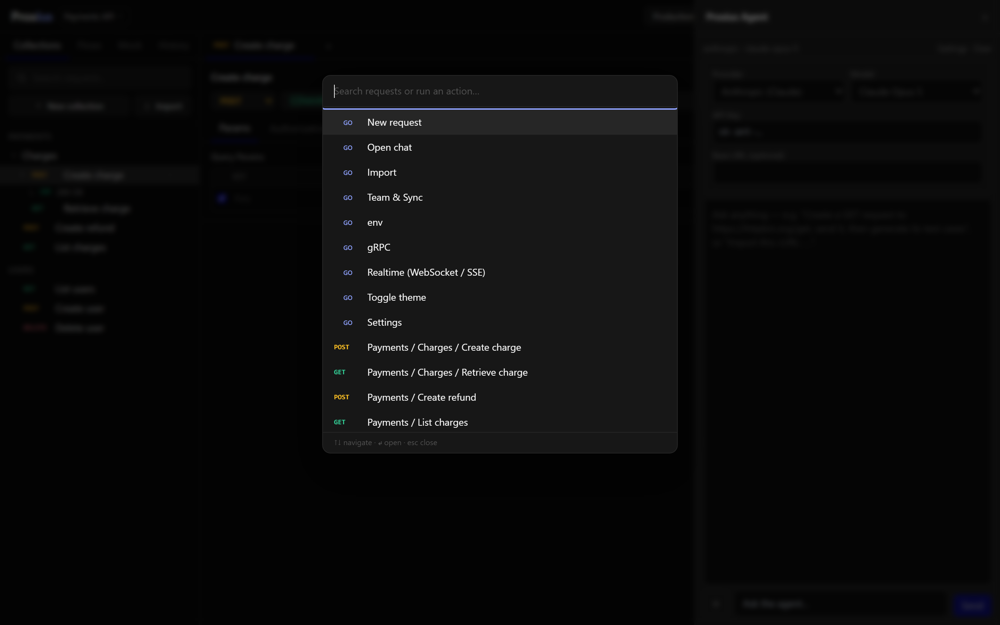
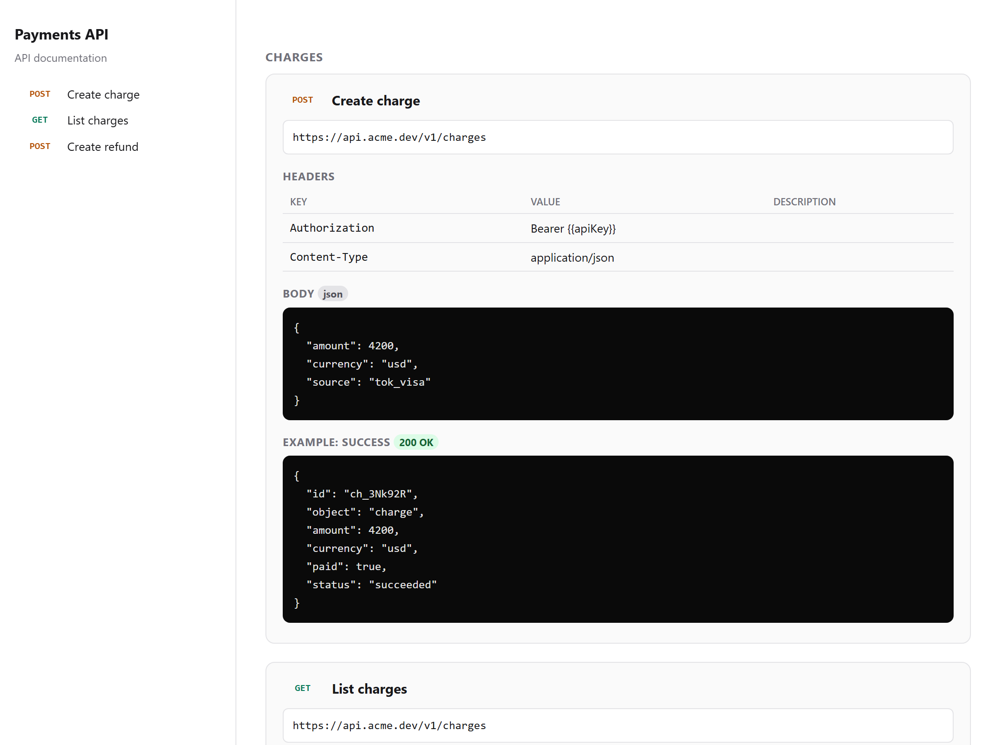

<h1 align="center">Proxius</h1>

<p align="center">
  <strong>A free, open-source, local-first API client for developers and QA.</strong><br />
  Every protocol, an AI assistant you power with your own key, real QA scenarios, mock servers, and Git-native projects — in one desktop app.
</p>

<p align="center">
  
  
  
  
</p>

<p align="center">
  
</p>

Proxius runs on your machine. Your requests, environments and secrets stay on disk; you sync to Git or a
team server only when you choose. There is no account to create, no telemetry, and nothing is held back
behind a paid tier — the client, the test runner, the CLI and the team server are all open source.

It aims to cover the whole request lifecycle: from the first cURL you paste, through the tests you write
and the docs you ship, to the runs that happen in CI.

---

## Highlights

- **One tool for every protocol** — HTTP/REST, GraphQL, gRPC (unary, server-, client- and bidi-streaming, plus server reflection), WebSocket and Server-Sent Events.
- **Local-first, Git-native** — each project is a folder and a Git repository. Sync per project, or keep everything offline.
- **An AI assistant you control** — build requests, generate and fix tests, and compose flows using **your own** Anthropic, OpenAI, or local Ollama key. Calls go straight to the provider, never through a Proxius server.
- **QA built in** — declarative assertions (including JSON Schema), Given → Expected test scenarios, Gherkin export, data-driven runs and load testing.
- **Docs and mock servers** — one-click HTML API docs and a real HTTP mock server from your saved examples.
- **Runs in CI** — a `proxius` CLI with JUnit / HTML / JSON reports, a ready-made GitHub Action, and Slack / Discord / Teams alerts.
- **Built for daily use** — command palette, tabbed editor, request history, light and dark themes, and five interface languages.

---

## Feature tour

### AI that writes your requests and tests



Describe an endpoint and the assistant builds the request. Send it and it writes the test cases — then
fixes the ones that fail. It can also compose multi-step flows, import cURL and OpenAPI, attach images,
and reach external tools over MCP.

**Bring your own key.** Paste your Anthropic or OpenAI key and it is stored on your machine; requests are
sent directly to the provider. Prefer to stay offline? Point it at a local Ollama model and no prompt ever
leaves your device. No Proxius account, no token markup, nothing logged by us.

### Run everything from the keyboard



The command palette (`Ctrl`/`Cmd` + `K`) jumps to any request across every collection, or runs any action,
without touching the mouse. The sidebar has its own request search with breadcrumbs, and there are tabs,
history and shortcuts throughout.

### One click turns a collection into docs



Turn any collection into a clean, shareable HTML documentation page — endpoints, auth, parameters, request
bodies and example responses. Stand up a real HTTP mock server from the same saved examples while the
backend is still being built, and export to Postman, Playwright, k6 or a Proxius run file.

---

## Capabilities

<table>
<tr><td valign="top" width="50%">

**Protocols & requests**
- HTTP / REST, GraphQL
- gRPC — unary + server-, client- & bidi-streaming, with server reflection
- WebSocket & Server-Sent Events tester
- Bodies: JSON, text, `form-data` with file upload, `x-www-form-urlencoded`, binary
- Environment & path variables with `{{var}}`
- Pre-request & post-response scripts (`pm.*`), per request and per collection
- Per-request timeout, redirects, SSL verify & proxy

</td><td valign="top" width="50%">

**Auth & security**
- Bearer, Basic, API key and JWT
- OAuth 2.0 — client credentials, password and authorization code
- Inherited collection / folder authorization
- mTLS client certificates
- Cookie jar for session-based APIs
- Secrets masked in environments

</td></tr>
<tr><td valign="top">

**Testing & QA**
- Assertions: status, JSONPath, headers, response time, JSON Schema
- QA scenarios written as Given input → Expected response
- BDD / Gherkin export with Scenario Outline & Examples
- Data-driven runs from CSV or JSON
- Collection runner with pass / fail summary
- Load & performance testing — RPS and p50–p99 latency

</td><td valign="top">

**AI assistant**
- Build requests, flows & assertions from plain language
- Generate and auto-fix failing test cases
- Chat with file & image attachments
- Bring your own key — Anthropic, OpenAI, or local Ollama
- Import cURL & OpenAPI through the agent
- Connect external tools via MCP

</td></tr>
<tr><td valign="top">

**Automation & CI**
- `proxius run` command-line runner
- JUnit, HTML & JSON reports
- Ready-made GitHub Action
- Alerts to Slack, Discord & Teams webhooks
- Scheduled runs via CI cron
- Code generation in 8 languages

</td><td valign="top">

**Mock, docs & sharing**
- Real HTTP mock server from saved examples — in-app or via `proxius mock`
- One-click shareable HTML API docs
- Import Postman, Insomnia, HAR, cURL & OpenAPI / Swagger
- Export Postman / Newman, Playwright, k6 and `.pxs` run files

</td></tr>
<tr><td valign="top">

**Collaborate & sync**
- Multiple projects — each a folder & Git repository
- Per-project Git and team-server sync
- Realtime presence & inline comments
- Flows — chain requests, extract & pass variables
- Self-hostable team server (Axum + Postgres) with an admin CMS

</td><td valign="top">

**Workspace**
- Command palette, tabbed editor & request history
- Light & dark themes
- Five interface languages — English, Indonesia, Deutsch, Nederlands, 日本語
- Keyboard shortcuts throughout
- Desktop app on Windows, macOS & Linux

</td></tr>
</table>

---

## Architecture

The domain logic lives in Rust crates that are reused across the desktop app, the team server and the CLI —
so a request behaves identically wherever it runs. The desktop app is a Tauri shell around a Vite + React
UI; on the desktop the native Rust HTTP engine is used (no CORS limits), with a `fetch` fallback in the
browser.

```
crates/core     Domain model (Rust), exported to TypeScript via ts-rs
crates/engine   HTTP engine (reqwest) — shared by desktop, server & CLI
crates/grpc     gRPC client (tonic) — 4 RPC types + server reflection
crates/runner   Collection / assertion / load-test runner
crates/cli      `proxius` CLI — run, mock, load
crates/server   Team server (Axum + Postgres, sqlx)
crates/db       Database layer for the server
apps/desktop    Tauri desktop shell
ui/app          Request client SPA (Vite + React + TanStack)
ui/admin        Admin CMS for the team server
```

See [docs/ARCHITECTURE.md](docs/ARCHITECTURE.md) for the full picture.

---

## Getting started

### Prerequisites

- **Rust** (stable; MSVC toolchain on Windows)
- **Node** ≥ 20 and **pnpm**
- **Docker** (only for the optional team server)

Install workspace dependencies once:

```bash
pnpm install
```

### Run the desktop app (development)

Starts the Vite dev server and the Tauri shell together, with hot reload:

```bash
pnpm desktop
```

> Do not double-click `target/debug/proxius-desktop.exe` directly. The debug build points at the dev server
> (`localhost:5173`); without it running, the webview shows a blank page. Use `pnpm desktop`.

### Build a standalone app

A self-contained executable that embeds the frontend — no dev server needed:

```bash
cargo build --release -p proxius-desktop
# → target/release/proxius-desktop
```

For platform installers (MSI / NSIS / dmg / AppImage) via the Tauri bundler:

```bash
pnpm build:desktop
```

### Run the UI in a browser (quick, CORS-limited)

```bash
pnpm dev            # http://localhost:5173
```

### Command line (CI-friendly)

Export a `.pxs` run file from a collection in the app, then run it headlessly:

```bash
# Run a collection and emit a JUnit report
cargo run -p proxius-cli -- run collection.pxs --report junit --report-dir ./reports

# Serve saved example responses as a real HTTP mock
cargo run -p proxius-cli -- mock routes.mock.json --port 9090

# Load test: 20 virtual users for 30s
cargo run -p proxius-cli -- load collection.pxs --vus 20 --duration 30
```

`proxius run` supports `-e env.json`, `--var key=value`, `--data rows.csv` (data-driven),
`--report pretty|json|junit|html` (repeatable), and `--notify <webhook>`. It exits non-zero when any
assertion fails, so CI stops on failure.

### Team server (optional)

For realtime collaboration, sync and the admin CMS:

```bash
docker compose up -d
```

The server runs at `http://localhost:8080` and the admin CMS at `http://localhost:8080/admin`. The first
account to register becomes the administrator. Solo, local-first mode remains the default — the server is
entirely optional.

---

## Continuous integration

Proxius ships a composite GitHub Action that builds the CLI, runs a collection, uploads the reports and
propagates the exit code:

```yaml
- uses: ./.github/actions/proxius-run
  with:
    collection: examples/httpbin.pxs
    report-dir: reports
    notify: ${{ secrets.SLACK_WEBHOOK }}
```

A complete workflow is in [`.github/workflows/api-tests.yml`](.github/workflows/api-tests.yml), and the
setup is documented in [docs/ci-cd.md](docs/ci-cd.md).

---

## Contributing

Issues and pull requests are welcome. A few useful commands while developing:

```bash
cargo build            # build every Rust crate
cargo test             # unit tests (runner, engine, grpc) + regenerate TS bindings via ts-rs
pnpm --filter @proxius/app build   # type-check and build the UI
```

---

## License

Proxius is licensed under the **GNU Affero General Public License v3.0** (`AGPL-3.0-only`). You are free to
run, study, share and modify it; if you run a modified version as a network service, the AGPL requires you
to offer that version's source to its users. See [LICENSE](LICENSE) for the full text.
